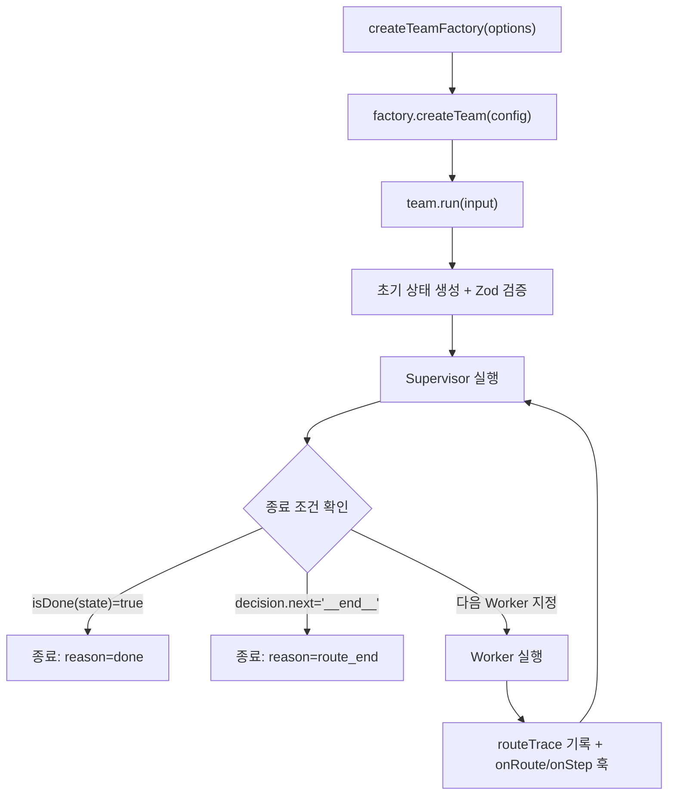

# Agent Team Monorepo

LangGraph 기반 에이전트 팀 오케스트레이션 패키지 `@agent-team/langgraph-team-factory`를 포함한 pnpm 모노레포입니다.

## 포함 패키지

- `@agent-team/langgraph-team-factory`

## 요구사항

- Node.js 20+
- pnpm 9+

## 설치

```bash
pnpm install
```

## 워크스페이스 명령

```bash
pnpm typecheck
pnpm lint
pnpm test
pnpm test:c8
pnpm build
```

## 빠른 시작

```ts
import { z } from "zod";
import { createTeamFactory } from "@agent-team/langgraph-team-factory";

type State = {
  stage: "triage" | "work" | "done";
  task: string;
  result?: string;
};

const stateSchema = z.object({
  stage: z.enum(["triage", "work", "done"]),
  task: z.string(),
  result: z.string().optional()
});

const factory = createTeamFactory<State, State, string>({
  stateSchema,
  validationMode: "strict"
});

const team = factory.createTeam({
  teamId: "quick-start-team",
  supervisor: {
    id: "supervisor",
    run: async (ctx) => {
      if (ctx.state.stage === "triage") {
        return {
          state: { ...ctx.state, stage: "work" },
          decision: { next: "worker" }
        };
      }

      return {
        state: { ...ctx.state, stage: "done" },
        decision: { next: "__end__" }
      };
    }
  },
  agents: [
    {
      id: "worker",
      run: async (ctx) => ({
        state: { ...ctx.state, result: `done: ${ctx.state.task}` },
        output: `done: ${ctx.state.task}`
      })
    }
  ],
  termination: {
    maxSteps: 6,
    isDone: (state) => state.stage === "done"
  }
});

const result = await team.run({
  stage: "triage",
  task: "summarize architecture"
});

console.log(result.output);
```

## 핵심 API

### `createTeamFactory(options)`

- `stateSchema`(필수): Zod 스키마
- `modelAdapter`(선택): 벤더 비종속 모델 어댑터
- `hooks`(선택): `onStep`, `onRoute`, `onError`
- `validationMode`(선택): `strict` | `input-only` (기본 `strict`)

### `factory.createTeam(config)`

- `teamId`
- `supervisor`
- `agents`
- `termination.maxSteps` (필수)
- `termination.isDone(state)` (필수)
- `inputToState` / `outputSelector` (선택)

### `team.run(input, runOptions?)`

- `timeoutMs`, `signal`, `initialState`
- `hooks` override
- `failOnHookError`

### `createDeclarativeAgent(config)`

- 프롬프트 템플릿 선언형 설정 (`system`, `developer`, `context`, `user`)
- 에이전트별 툴 실행 (`tools`)
- 재시도/백오프 (`retry.attempts`, `retry.backoffMs`)
- 에이전트별 타임아웃 (`timeoutMs`)
- 응답 파싱 (`responseSchema` 또는 `parseResponse`)
- 상태/출력/라우팅 후처리 (`stateResolver`, `outputResolver`, `decisionResolver`)

```ts
import { createDeclarativeAgent } from "@agent-team/langgraph-team-factory";
import { z } from "zod";

const researcher = createDeclarativeAgent({
  id: "researcher",
  prompt: {
    system: "너는 리서처다.",
    user: (ctx) => `질문: ${ctx.input.query}`
  },
  tools: [
    {
      name: "memory",
      execute: async () => "최근 요약"
    }
  ],
  retry: { attempts: 2, backoffMs: 100 },
  responseSchema: z.object({
    summary: z.string()
  }),
  stateResolver: ({ ctx, parsed }) => ({
    ...ctx.state,
    notes: [...ctx.state.notes, parsed?.summary ?? "none"]
  })
});
```

## 런타임 동작 요약

1. 입력 상태 생성/검증
2. Supervisor 실행
3. Supervisor가 다음 Worker를 라우팅
4. Worker 실행 후 Supervisor로 복귀
5. `isDone(state)` 또는 `__end__`로 종료
6. `TeamRunResult` 반환

## 실행 흐름 다이어그램



## 오류 모델

- `InvalidStateError`
- `UnknownAgentError`
- `MaxStepsExceededError`
- `RoutingError`

기본적으로 훅 오류는 `onError`로 보고하고 실행은 계속됩니다.
`failOnHookError: true`를 주면 훅 오류에서 즉시 실패합니다.

## 예제 실행

```bash
pnpm example:supervisor
pnpm example:tool
pnpm example:declarative
```

- `examples/supervisor-routing/index.mjs`
- `examples/tool-enabled-agent/index.mjs`
- `examples/declarative-team/index.mjs`

## 문서

- 아키텍처 설명: `ARCHITECTURE.md`
- 패키지 README: `packages/langgraph-team-factory/README.md`
- 변경 이력: `CHANGELOG.md`

## 라이선스

MIT (`LICENSE`)
